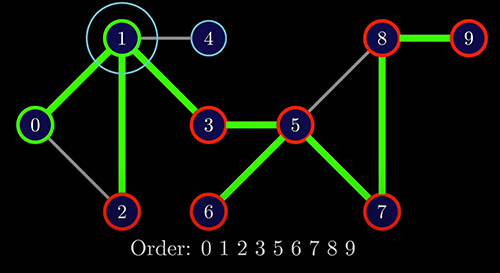
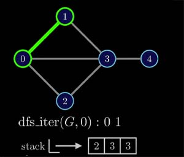

# Intuition




# DFS Implementation 1


## Solution 1

```python
def dfs(G,v):
    visit(v)
    for w in G.neighbors(v):
        dfs(G,w)
```

Issue : infinite cycle because of node 0

## Solution 2

Mark nodes as visited

```python
marked = [False] * G.size()
def dfs(G,v):
    visit(v)
    marked[v]= True
    for w in G.neighbors(v):
        if not marked[w]:
            dfs(G,w)
```

pre-order implementation

# DFS Implementation 2

```python
marked = [False] * G.size()
def dfs_iter(G,v):
    stack = [v]
    while len(stack) > 0:
        v= stack.pop()
        if not marked[v]:
            visit(v)
            marked[v]= True
            for w in G.neighbors(v):
                stack.append(w)
```

Useful if we need to identify the DFS ordering by hand





## Performance perspective :

Both run in O(V + E) time

# Preorder vs PostOrder


post-order implementation

```python
marked = [False] * G.size()
def dfs(G,v):
    # visit(v) pre-order implementation
    marked[v]= True
    for w in G.neighbors(v):
        if not marked[w]:
            dfs(G,w)
    visit(v) # post-order implementation
```

# DFS Application

- Cycle Detection
- Finding Connected Components
- Topological Sort

# DFS Game : Maze Generator


