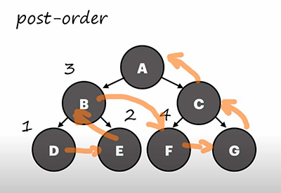

# dfs

special thanks to Amen for providing motivation for this one

# dfs with tree

## pre_order :

expecting :

up
Node (A)
up
Node (B)
up
Node (D)
up
up
up
Node (E)
up
up
up
Node (C)
up
Node (F)
up
up
up
Node (G)
up
up

## in_order :

expecting :

up
up
up
up
Node (D)
up
Node (B)
up
up
Node (E)
up
Node (A)
up
up
up
Node (F)
up
Node (C)
up
up
Node (G)
up

## post_order :

Expecting :

up
up
up
up
up
Node (D)
up
up
up
Node (E)
Node (B)
up
up
up
up
Node (F)
up
up
up
Node (G)
Node (C)
Node (A)

# iterative

expecting :

Node (A)
Node (B)
Node (D)
Node (E)
Node (C)
Node (F)
Node (G)
